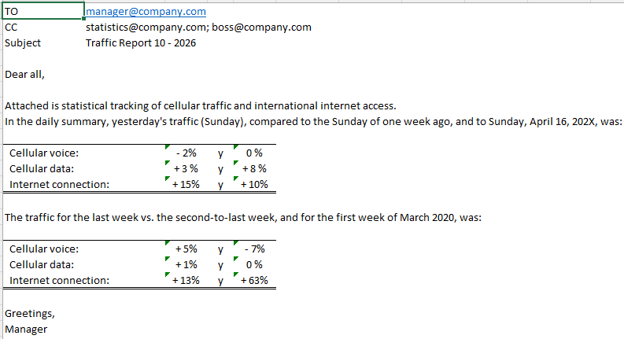
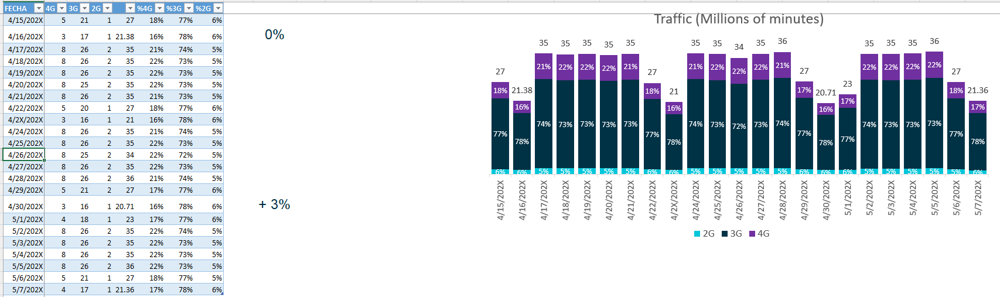
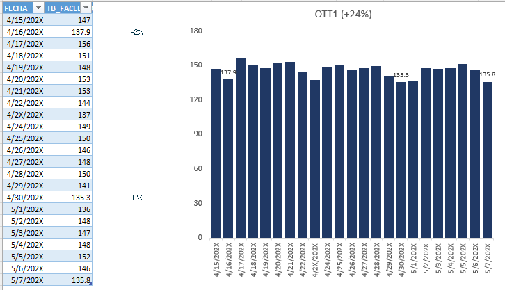

# Excel VBA Traffic Report

Produces the weekly network traffic report for the company's Executive Committee with one macro. It refreshes voice, data and OTT traffic from the Oracle database, updates the linked PowerPoint presentation and prepares the summary email in Outlook with the presentation attached. Preparation time went from 2 hours to 15 minutes.

Every run produces a new presentation for the date on which the program is executed: it is updated, saved under that date and attached to a new email that carries the summary of the presentation.

## What it does

- Calculates the reporting dates on its own from today's date: the start of the query window, the Monday of the current week and the date stamp used in the file name
- Refreshes every query in the workbook against the Oracle database and waits until all of them finish before going on
- Opens the PowerPoint presentation, updates the charts linked to the workbook, renames the file with the new date and saves it
- Builds the email in Outlook: recipients, copy and subject are read from the `MAIL` sheet, and the body is the formatted summary from the same sheet, converted to HTML so the tables keep their layout
- Attaches the updated presentation and leaves the email open for a final review before sending

## The summary

The body of the email compares traffic for cellular voice, cellular data and internet connection in two ways:

- **Daily:** yesterday against the same weekday one week earlier, and against a fixed reference date
- **Weekly:** the last week against the week before, and against a fixed reference week

The percentages are calculated in the workbook, so the text is ready as soon as the data is refreshed.

## Traffic data

**Voice traffic.** `queries/daily-voice-traffic.txt` returns the daily traffic per technology, converted from Erlangs to millions of minutes. The sheet adds the share of 2G, 3G and 4G and shows it in a stacked chart.

**OTT traffic.** `queries/daily-ott-traffic.txt` returns the daily volume in terabytes of an OTT application, taken from the DPI records by protocol. The chart title shows the change against the reference period.

Both queries take the start date as a parameter (`WHERE FECHA >= ?`), so the window moves forward every day without editing the SQL.

## Tools

Excel, VBA (automation of PowerPoint and Outlook), SQL on Oracle with parameterized queries, linked charts

## Files

- `traffic-report.xlsm`: the workbook
- `vba/`: exported VBA module
- `queries/`: connection string and SQL behind the traffic sheets
- `images/`: screenshots

## How to try it

The workbook opens with sample data already loaded, so the sheets, the charts and the email summary can be explored without a database. Running the macro requires Excel, PowerPoint and Outlook for Windows, an Oracle ODBC data source, a presentation linked to the workbook and your own connection details and folder path in the VBA module.

## Data

Dates, traffic figures, application names and email addresses are anonymized. Connection details and file paths are placeholders.

The function that converts a range to HTML was written by Ron de Bruin and is credited in the code.
